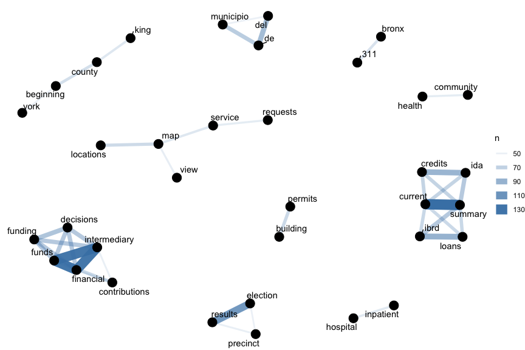
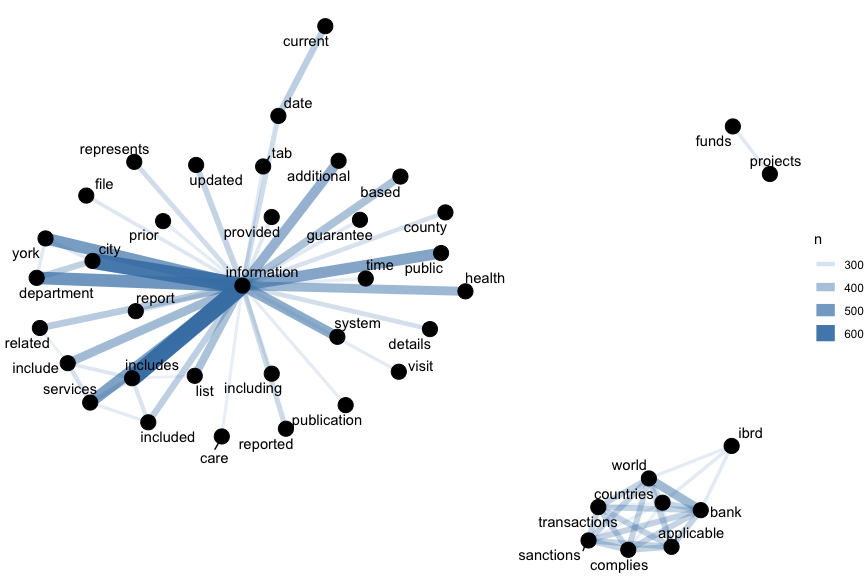
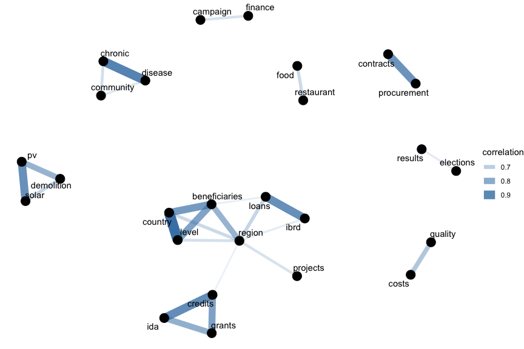
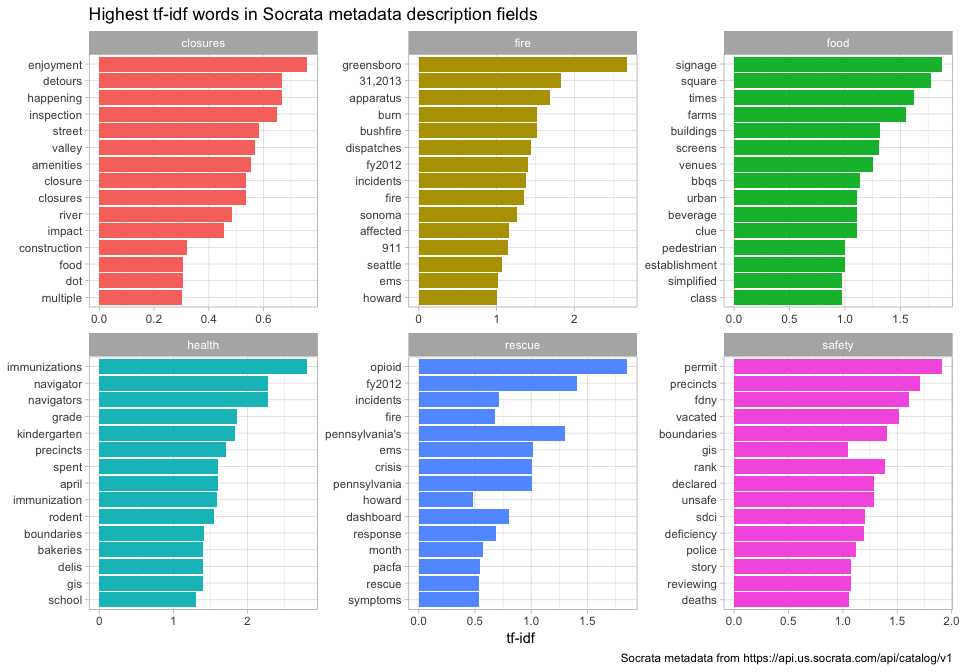
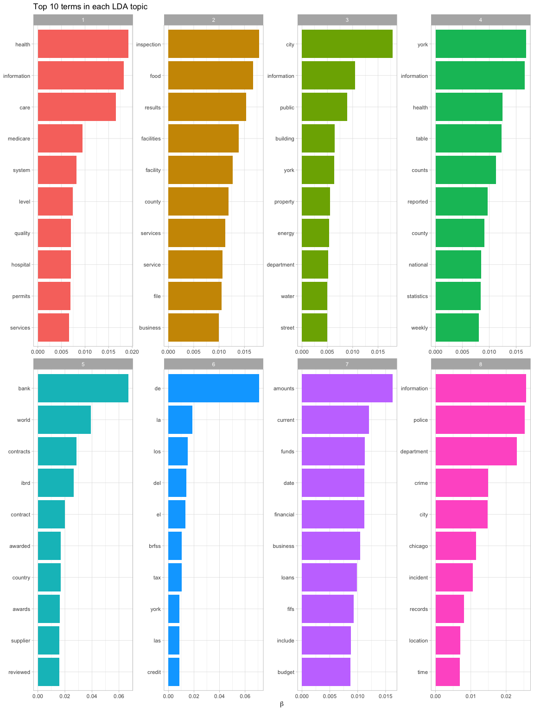
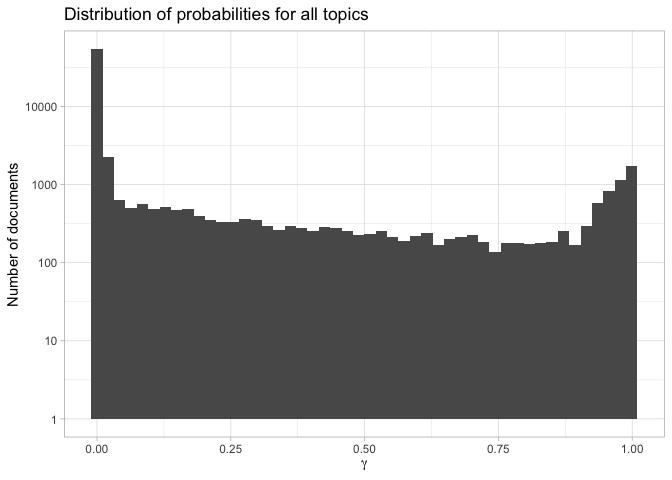
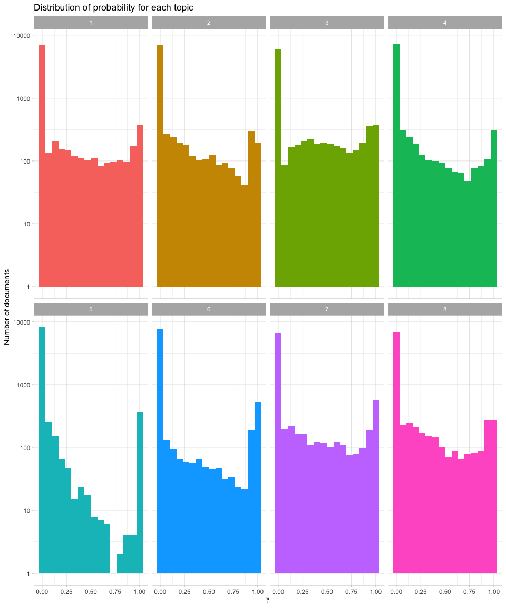
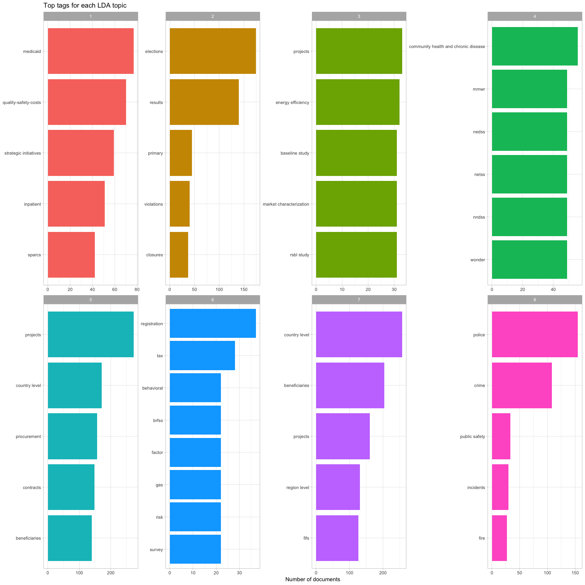

The Socrata data platform hosts tens of thousands of government datasets. Governments large and small publish data on crime, permits, finance, healthcare, research, performance, and more for citizens to use. While this large corpus of government data is already accessible via [opendatanetwork.com](opendatanetwork.com), this API is a powerful way to access and explore all public metadata published on the Socrata platform.

Using the [Socrata Discovery API](https://socratadiscovery.docs.apiary.io) I'll use metadata from these datasets to understand the connections between them. 

The metadata includes information like the name of the dataset, a description field, tags for the dataset that have been assigned by a human being, and so forth. The metadata for all its public datasets is [available online in JSON format](http://api.us.socrata.com/api/catalog/v1).

In this report, I will analyze the Socrata Open Data Network metadata as a text dataset and perform text mining techniques using the R library [tidytext](https://www.tidytextmining.com/). I will preform word co-occurrences and correlations, tf-idf, and topic modeling to explore the connections between the datasets. I will seek to find if datasets are related to one other and find clusters of similar datasets. Since the Socrata Open Data Network provides several text fields in the metadata, most importantly the name, description, and tag fields, I can show connections between the fields to better understand the connections between the Socrata Open Data Network API datasets.

## How data is organized at the Socrata Open Data Network

Download the JSON file and take a look at the names of what is stored in the metadata.


```r
library(jsonlite)

metadata <- jsonlite::fromJSON("https://api.us.socrata.com/api/catalog/v1?limit=10000")

# look at column names in dataset
base::names(metadata$results)
```

```
## [1] "resource"          "classification"    "metadata"          "permalink"        
## [5] "link"              "owner"             "preview_image_url" "published_copy"
```

The name, description, and  for each dataset will be the features of interest.


```r
# text fields of interest are within the 'resource' and 'classification' object
base::class(metadata$results$resource$name)
```

```
## [1] "character"
```

```r
base::class(metadata$results$resource$description)
```

```
## [1] "character"
```

```r
base::class(metadata$results$classification$categories) # domain_tags are an array (or list)
```

```
## [1] "list"
```

The name and description fields are stored as character vectors, and the domain_tags are stored as a list of character vectors.

### Data preparation


```r
## Create dataframes of title, description, and tags fields
library(tidyverse)

socrata_title <- dplyr::data_frame(
  id = metadata$results$resource$id,
  title = metadata$results$resource$name
)

# show title fields
socrata_title %>%
  dplyr::sample_n(10) %>%
  knitr::kable() %>%
  kableExtra::kable_styling(bootstrap_options = c("striped", "hover", "condensed", "responsive")) %>%
  kableExtra::scroll_box(height = "300px")
```

<div style="border: 1px solid #ddd; padding: 5px; overflow-y: scroll; height:300px; "><table class="table table-striped table-hover table-condensed table-responsive" style="margin-left: auto; margin-right: auto;">
 <thead>
  <tr>
   <th style="text-align:left;"> id </th>
   <th style="text-align:left;"> title </th>
  </tr>
 </thead>
<tbody>
  <tr>
   <td style="text-align:left;"> tua8-2qwc </td>
   <td style="text-align:left;"> 2010 General  - Election Results for LD5 </td>
  </tr>
  <tr>
   <td style="text-align:left;"> dmc2-d98i </td>
   <td style="text-align:left;"> Dusty </td>
  </tr>
  <tr>
   <td style="text-align:left;"> 9g5a-r9zs </td>
   <td style="text-align:left;"> E-Government Service Portfolio - OSCIO </td>
  </tr>
  <tr>
   <td style="text-align:left;"> 2vvn-pdyi </td>
   <td style="text-align:left;"> NYS Lottery Retailers </td>
  </tr>
  <tr>
   <td style="text-align:left;"> 26fe-arqy </td>
   <td style="text-align:left;"> Employee Payroll  (Searchable) </td>
  </tr>
  <tr>
   <td style="text-align:left;"> va6n-ui5f </td>
   <td style="text-align:left;"> Lista de EPSAGRO inscritas, acreditadas y habilitadas del Departamento de Boyacá 2017 </td>
  </tr>
  <tr>
   <td style="text-align:left;"> 45um-c62r </td>
   <td style="text-align:left;"> Rates of TBI-related Emergency Department Visits, Hospitalizations, and Deaths - United States, 2001 – 2010 </td>
  </tr>
  <tr>
   <td style="text-align:left;"> nmvn-mx4x </td>
   <td style="text-align:left;"> Small Commercial Solar Incentive Levels and Available Capacity </td>
  </tr>
  <tr>
   <td style="text-align:left;"> mjrr-dybz </td>
   <td style="text-align:left;"> Planning Department Development Application </td>
  </tr>
  <tr>
   <td style="text-align:left;"> ujhw-8y22 </td>
   <td style="text-align:left;"> Improving Care </td>
  </tr>
</tbody>
</table></div>


```r
socrata_desc <- dplyr::data_frame(
  id = metadata$results$resource$id,
  desc = metadata$results$resource$description
  ) %>% 
  dplyr::filter(!purrr::map_lgl(desc, is.null)) %>% # filter out null values
  dplyr::filter(!purrr::map_lgl(desc, is.na)) %>% # filter out NA values
  dplyr::filter(desc != "") # filter out blank values
  
  
# take a sample and show description fields
socrata_desc %>%
  dplyr::select(desc) %>%
  dplyr::sample_n(5) %>%
  knitr::kable() %>%
  kableExtra::kable_styling(bootstrap_options = c("striped", "hover", "condensed", "responsive")) %>%
  kableExtra::scroll_box(height = "300px")
```

<div style="border: 1px solid #ddd; padding: 5px; overflow-y: scroll; height:300px; "><table class="table table-striped table-hover table-condensed table-responsive" style="margin-left: auto; margin-right: auto;">
 <thead>
  <tr>
   <th style="text-align:left;"> desc </th>
  </tr>
 </thead>
<tbody>
  <tr>
   <td style="text-align:left;"> The innovative financing and governance arrangements of Financial Intermediary Funds (FIFs) enable funds to be raised from multiple sources, including from sovereign and private sources. FIFs can receive contributions in the form of concessional loans and capital contribution in addition to traditional grant funds. In addition, FIFs can receive funds from innovative sources, such as proceeds from CER sales. This chart shows contributions to all FIFs provided by a country during a certain calendar year. </td>
  </tr>
  <tr>
   <td style="text-align:left;"> &lt;div&gt;This dataset shows whether each dataset on data.maryland.gov has been updated recently enough. For example, datasets containing weekly data should be updated at least every 7 days. Datasets containing monthly data should be updated at least every 31 days. This dataset also shows a overview of metadata from all data.maryland.gov datasets.&lt;br&gt;&lt;/div&gt; </td>
  </tr>
  <tr>
   <td style="text-align:left;"> New York City school level College Board SAT results for the graduating seniors of 2010.  Records contain 2010 College-bound seniors mean SAT scores. 

Records with 5 or fewer students are suppressed (marked ‘s’). 

College-bound seniors are those students that complete the SAT Questionnaire when they register for the SAT and identify that they will graduate from high school in a specific year. For example, the 2010 college-bound seniors are those students that self-reported they would graduate in 2010. Students are not required to complete the SAT Questionnaire in order to register for the SAT. Students who do not indicate which year they will graduate from high school will not be included in any college-bound senior report.  

Students are linked to schools by identifying which school they attend when registering for a College Board exam. A student is only included in a school’s report if he/she self-reports being enrolled at that school. 

Data collected and processed by the College Board. </td>
  </tr>
  <tr>
   <td style="text-align:left;"> The Adult Care Facility Directory contains a listing of Adult Care Facilities that are currently licensed in New York State. New York State, through the New York State Department of Health, licenses and supervises adult care facilities which provide temporary or long-term, non-medical residential care services to adults who are substantially unable to live independently. </td>
  </tr>
  <tr>
   <td style="text-align:left;"> All BPD data on Open Baltimore is preliminary data and subject to change.  The information presented through Open Baltimore represents Part I victim based crime data. The data do not represent statistics submitted to the FBI's Uniform Crime Report (UCR); therefore any comparisons are strictly prohibited. For further clarification of UCR data, please visit http://www.fbi.gov/about-us/cjis/ucr/ucr. Please note that this data is preliminary and subject to change. Prior month data is likely to show changes when it is refreshed on a monthly basis.  All data is geocoded to the approximate latitude/longitude location of the incident and excludes those records for which an address could not be geocoded. Any attempt to match the approximate location of the incident to an exact address is strictly prohibited. </td>
  </tr>
</tbody>
</table></div>


```r
# all datasets have a title and description but not all have domain_tags
socrata_tags <- dplyr::data_frame(
  id = metadata$results$resource$id,
  tag = metadata$results$classification$domain_tags
  ) %>% 
  dplyr::filter(!purrr::map_lgl(tag, is.null)) %>% # filter out null values
  tidyr::unnest(tag) # unlist the tag array and make the dataframe long

# show tags fields
socrata_tags %>%
  dplyr::sample_n(100) %>%
  knitr::kable() %>%
  kableExtra::kable_styling(bootstrap_options = c("striped", "hover", "condensed", "responsive")) %>%
  kableExtra::scroll_box(height = "300px")
```

<div style="border: 1px solid #ddd; padding: 5px; overflow-y: scroll; height:300px; "><table class="table table-striped table-hover table-condensed table-responsive" style="margin-left: auto; margin-right: auto;">
 <thead>
  <tr>
   <th style="text-align:left;"> id </th>
   <th style="text-align:left;"> tag </th>
  </tr>
 </thead>
<tbody>
  <tr>
   <td style="text-align:left;"> m3s8-jyeu </td>
   <td style="text-align:left;"> quality of care </td>
  </tr>
  <tr>
   <td style="text-align:left;"> tft4-2tch </td>
   <td style="text-align:left;"> grades </td>
  </tr>
  <tr>
   <td style="text-align:left;"> eb4y-d4ic </td>
   <td style="text-align:left;"> osh </td>
  </tr>
  <tr>
   <td style="text-align:left;"> 8hpj-294h </td>
   <td style="text-align:left;"> mechanical </td>
  </tr>
  <tr>
   <td style="text-align:left;"> skzk-tcq9 </td>
   <td style="text-align:left;"> pmf </td>
  </tr>
  <tr>
   <td style="text-align:left;"> uedp-fegm </td>
   <td style="text-align:left;"> energy </td>
  </tr>
  <tr>
   <td style="text-align:left;"> xnhu-aczu </td>
   <td style="text-align:left;"> sign permit </td>
  </tr>
  <tr>
   <td style="text-align:left;"> wyja-ysz2 </td>
   <td style="text-align:left;"> public works </td>
  </tr>
  <tr>
   <td style="text-align:left;"> kvbx-erfw </td>
   <td style="text-align:left;"> agency performance </td>
  </tr>
  <tr>
   <td style="text-align:left;"> 9x8y-nux4 </td>
   <td style="text-align:left;"> renewable </td>
  </tr>
  <tr>
   <td style="text-align:left;"> fr79-srce </td>
   <td style="text-align:left;"> community health and chronic disease </td>
  </tr>
  <tr>
   <td style="text-align:left;"> 5zaw-hj3p </td>
   <td style="text-align:left;"> country level </td>
  </tr>
  <tr>
   <td style="text-align:left;"> 3rgd-zjxx </td>
   <td style="text-align:left;"> water quality </td>
  </tr>
  <tr>
   <td style="text-align:left;"> 5u9x-y4iz </td>
   <td style="text-align:left;"> relocation permit </td>
  </tr>
  <tr>
   <td style="text-align:left;"> abfj-y7uq </td>
   <td style="text-align:left;"> driver </td>
  </tr>
  <tr>
   <td style="text-align:left;"> pt2v-9a3h </td>
   <td style="text-align:left;"> handicap </td>
  </tr>
  <tr>
   <td style="text-align:left;"> u2u3-22pf </td>
   <td style="text-align:left;"> popayan </td>
  </tr>
  <tr>
   <td style="text-align:left;"> n7es-ur7c </td>
   <td style="text-align:left;"> ground-level ozone </td>
  </tr>
  <tr>
   <td style="text-align:left;"> h7rm-fz6m </td>
   <td style="text-align:left;"> benchmarking </td>
  </tr>
  <tr>
   <td style="text-align:left;"> 5fn4-dr26 </td>
   <td style="text-align:left;"> city government </td>
  </tr>
  <tr>
   <td style="text-align:left;"> cpkv-aajs </td>
   <td style="text-align:left;"> construction </td>
  </tr>
  <tr>
   <td style="text-align:left;"> 8xjf-z55e </td>
   <td style="text-align:left;"> city services </td>
  </tr>
  <tr>
   <td style="text-align:left;"> 8z4h-2ak6 </td>
   <td style="text-align:left;"> employment </td>
  </tr>
  <tr>
   <td style="text-align:left;"> pknd-dutm </td>
   <td style="text-align:left;"> square </td>
  </tr>
  <tr>
   <td style="text-align:left;"> 3cdm-p29e </td>
   <td style="text-align:left;"> doitt </td>
  </tr>
  <tr>
   <td style="text-align:left;"> a9we-mtpn </td>
   <td style="text-align:left;"> connectivity </td>
  </tr>
  <tr>
   <td style="text-align:left;"> ya2t-3mrd </td>
   <td style="text-align:left;"> payroll </td>
  </tr>
  <tr>
   <td style="text-align:left;"> q8xn-hhm3 </td>
   <td style="text-align:left;"> beneficiaries </td>
  </tr>
  <tr>
   <td style="text-align:left;"> xgwu-c37w </td>
   <td style="text-align:left;"> noxious weeds </td>
  </tr>
  <tr>
   <td style="text-align:left;"> xbn8-g7iv </td>
   <td style="text-align:left;"> legislature </td>
  </tr>
  <tr>
   <td style="text-align:left;"> kahe-efs3 </td>
   <td style="text-align:left;"> bpc </td>
  </tr>
  <tr>
   <td style="text-align:left;"> m5c8-fvpq </td>
   <td style="text-align:left;"> enforcement </td>
  </tr>
  <tr>
   <td style="text-align:left;"> 6uza-cd7z </td>
   <td style="text-align:left;"> rescue </td>
  </tr>
  <tr>
   <td style="text-align:left;"> mfzt-js4n </td>
   <td style="text-align:left;"> gis </td>
  </tr>
  <tr>
   <td style="text-align:left;"> wxae-84gr </td>
   <td style="text-align:left;"> ifc </td>
  </tr>
  <tr>
   <td style="text-align:left;"> hzzz-eg3r </td>
   <td style="text-align:left;"> precincts </td>
  </tr>
  <tr>
   <td style="text-align:left;"> yd42-ttr4 </td>
   <td style="text-align:left;"> mesa sectoriales </td>
  </tr>
  <tr>
   <td style="text-align:left;"> f2du-824e </td>
   <td style="text-align:left;"> cars </td>
  </tr>
  <tr>
   <td style="text-align:left;"> jwz2-cge4 </td>
   <td style="text-align:left;"> rainfall </td>
  </tr>
  <tr>
   <td style="text-align:left;"> 7xmz-2ur8 </td>
   <td style="text-align:left;"> education </td>
  </tr>
  <tr>
   <td style="text-align:left;"> wn3p-qsan </td>
   <td style="text-align:left;"> volcanic plumes </td>
  </tr>
  <tr>
   <td style="text-align:left;"> mqvy-dtax </td>
   <td style="text-align:left;"> bronx </td>
  </tr>
  <tr>
   <td style="text-align:left;"> smb2-b252 </td>
   <td style="text-align:left;"> police </td>
  </tr>
  <tr>
   <td style="text-align:left;"> tid3-g26p </td>
   <td style="text-align:left;"> permisos uso </td>
  </tr>
  <tr>
   <td style="text-align:left;"> 547a-qp7h </td>
   <td style="text-align:left;"> acacías </td>
  </tr>
  <tr>
   <td style="text-align:left;"> c32y-ud8a </td>
   <td style="text-align:left;"> collaborating for clients </td>
  </tr>
  <tr>
   <td style="text-align:left;"> 88g8-5mnd </td>
   <td style="text-align:left;"> employee </td>
  </tr>
  <tr>
   <td style="text-align:left;"> 9gcg-vghr </td>
   <td style="text-align:left;"> unpaid </td>
  </tr>
  <tr>
   <td style="text-align:left;"> 8wk5-pp5m </td>
   <td style="text-align:left;"> affordable care act </td>
  </tr>
  <tr>
   <td style="text-align:left;"> qvuk-dgpr </td>
   <td style="text-align:left;"> license </td>
  </tr>
  <tr>
   <td style="text-align:left;"> 7xpx-5fte </td>
   <td style="text-align:left;"> accident </td>
  </tr>
  <tr>
   <td style="text-align:left;"> vh2s-8wb2 </td>
   <td style="text-align:left;"> inpatient </td>
  </tr>
  <tr>
   <td style="text-align:left;"> 6q2s-9pnn </td>
   <td style="text-align:left;"> new building </td>
  </tr>
  <tr>
   <td style="text-align:left;"> 6vp6-wxuq </td>
   <td style="text-align:left;"> prevalence </td>
  </tr>
  <tr>
   <td style="text-align:left;"> i8h7-mn6v </td>
   <td style="text-align:left;"> business name </td>
  </tr>
  <tr>
   <td style="text-align:left;"> r4kn-u4a2 </td>
   <td style="text-align:left;"> county data </td>
  </tr>
  <tr>
   <td style="text-align:left;"> h4hj-g7g5 </td>
   <td style="text-align:left;"> allocations </td>
  </tr>
  <tr>
   <td style="text-align:left;"> qwux-prpy </td>
   <td style="text-align:left;"> clear </td>
  </tr>
  <tr>
   <td style="text-align:left;"> pknd-dutm </td>
   <td style="text-align:left;"> art </td>
  </tr>
  <tr>
   <td style="text-align:left;"> hfm8-take </td>
   <td style="text-align:left;"> donors </td>
  </tr>
  <tr>
   <td style="text-align:left;"> py8w-ca47 </td>
   <td style="text-align:left;"> postcensal </td>
  </tr>
  <tr>
   <td style="text-align:left;"> 5g2s-tnb7 </td>
   <td style="text-align:left;"> sales and use tax </td>
  </tr>
  <tr>
   <td style="text-align:left;"> fymg-3wv3 </td>
   <td style="text-align:left;"> childcare </td>
  </tr>
  <tr>
   <td style="text-align:left;"> w6qn-gx72 </td>
   <td style="text-align:left;"> spin </td>
  </tr>
  <tr>
   <td style="text-align:left;"> vfe9-k7vc </td>
   <td style="text-align:left;"> bus </td>
  </tr>
  <tr>
   <td style="text-align:left;"> wd85-n28p </td>
   <td style="text-align:left;"> property tax </td>
  </tr>
  <tr>
   <td style="text-align:left;"> b6tj-gt35 </td>
   <td style="text-align:left;"> banner </td>
  </tr>
  <tr>
   <td style="text-align:left;"> dwqk-w36f </td>
   <td style="text-align:left;"> postdiarrheal </td>
  </tr>
  <tr>
   <td style="text-align:left;"> h9gi-nx95 </td>
   <td style="text-align:left;"> collisions </td>
  </tr>
  <tr>
   <td style="text-align:left;"> rgfe-8y2z </td>
   <td style="text-align:left;"> mayor's office of long term planning and sustainability (oltps) </td>
  </tr>
  <tr>
   <td style="text-align:left;"> 65xz-asgc </td>
   <td style="text-align:left;"> pesticides </td>
  </tr>
  <tr>
   <td style="text-align:left;"> djpb-rjn9 </td>
   <td style="text-align:left;"> program evaluation </td>
  </tr>
  <tr>
   <td style="text-align:left;"> mpue-vn67 </td>
   <td style="text-align:left;"> sparcs </td>
  </tr>
  <tr>
   <td style="text-align:left;"> yuq5-65xt </td>
   <td style="text-align:left;"> performance-based payment </td>
  </tr>
  <tr>
   <td style="text-align:left;"> 32cx-q9bj </td>
   <td style="text-align:left;"> building new </td>
  </tr>
  <tr>
   <td style="text-align:left;"> jj7d-djgr </td>
   <td style="text-align:left;"> grantees </td>
  </tr>
  <tr>
   <td style="text-align:left;"> rycq-b8jg </td>
   <td style="text-align:left;"> odfw </td>
  </tr>
  <tr>
   <td style="text-align:left;"> b3ae-eupi </td>
   <td style="text-align:left;"> delis </td>
  </tr>
  <tr>
   <td style="text-align:left;"> j4zm-9kqu </td>
   <td style="text-align:left;"> disclosure </td>
  </tr>
  <tr>
   <td style="text-align:left;"> ukww-xkmj </td>
   <td style="text-align:left;"> dead   animal removal </td>
  </tr>
  <tr>
   <td style="text-align:left;"> 5rab-bshx </td>
   <td style="text-align:left;"> beneficiaries </td>
  </tr>
  <tr>
   <td style="text-align:left;"> uk7p-iqpz </td>
   <td style="text-align:left;"> snap </td>
  </tr>
  <tr>
   <td style="text-align:left;"> n5iq-rskv </td>
   <td style="text-align:left;"> bridge </td>
  </tr>
  <tr>
   <td style="text-align:left;"> jew6-k2tq </td>
   <td style="text-align:left;"> cms </td>
  </tr>
  <tr>
   <td style="text-align:left;"> n2dz-pwuk </td>
   <td style="text-align:left;"> labeling </td>
  </tr>
  <tr>
   <td style="text-align:left;"> g6gf-cj67 </td>
   <td style="text-align:left;"> aid </td>
  </tr>
  <tr>
   <td style="text-align:left;"> t753-n3tv </td>
   <td style="text-align:left;"> country level </td>
  </tr>
  <tr>
   <td style="text-align:left;"> hfe6-4nr6 </td>
   <td style="text-align:left;"> self-insured </td>
  </tr>
  <tr>
   <td style="text-align:left;"> y3c3-hqwu </td>
   <td style="text-align:left;"> elevator </td>
  </tr>
  <tr>
   <td style="text-align:left;"> 7mgr-iety </td>
   <td style="text-align:left;"> red light cameras </td>
  </tr>
  <tr>
   <td style="text-align:left;"> d4iy-9uh7 </td>
   <td style="text-align:left;"> community centers </td>
  </tr>
  <tr>
   <td style="text-align:left;"> yqdr-edy8 </td>
   <td style="text-align:left;"> sheriff </td>
  </tr>
  <tr>
   <td style="text-align:left;"> 6d4u-qybd </td>
   <td style="text-align:left;"> natural area </td>
  </tr>
  <tr>
   <td style="text-align:left;"> wj5k-n3n8 </td>
   <td style="text-align:left;"> ifc </td>
  </tr>
  <tr>
   <td style="text-align:left;"> ps8r-e55x </td>
   <td style="text-align:left;"> pm2.5 </td>
  </tr>
  <tr>
   <td style="text-align:left;"> xt4z-bnwh </td>
   <td style="text-align:left;"> map_layer </td>
  </tr>
  <tr>
   <td style="text-align:left;"> k5bm-9tcj </td>
   <td style="text-align:left;"> business name </td>
  </tr>
  <tr>
   <td style="text-align:left;"> h4zs-rypf </td>
   <td style="text-align:left;"> beneficiaries </td>
  </tr>
  <tr>
   <td style="text-align:left;"> 5i2c-y2u6 </td>
   <td style="text-align:left;"> parcel </td>
  </tr>
  <tr>
   <td style="text-align:left;"> msxg-ssda </td>
   <td style="text-align:left;"> ventilation </td>
  </tr>
</tbody>
</table></div>


```r
# Create dataframes of tokenized title, description, and tags fields
library(tidytext)

title_tokens <- socrata_title %>%
  tidytext::unnest_tokens(word, title) %>%
  dplyr::anti_join(stop_words, by = "word") # remove default stop words

desc_tokens <- socrata_desc %>%
  tidytext::unnest_tokens(word, desc) %>%
  dplyr::anti_join(stop_words, by = "word") # remove default stop words

# don't remove any stop words
# the thinking here is that these tags are selected by a user
# and have meaning to both the dataset and the user
# there is considerablly more thought placed on these tags than say,
# a title or description
# Put differently, these are not an arbitrary listing of tags 
# and thus, they should all remain
tag_tokens <- socrata_tags %>%
  tidytext::unnest_tokens(word, tag) # we're NOT removing any tags here
```

The name, description, and domain_tag datasets have been prepared and are now ready for exploration.


```r
# remove those extra stop words from title and description
title_tokens_reduced <- title_tokens %>%
  dplyr::anti_join(extra_stopwords, by = "word")

desc_tokens_reduced <- desc_tokens %>%
  dplyr::anti_join(extra_stopwords, by = "word")

tag_tokens_reduced <- tag_tokens %>%
  dplyr::anti_join(dplyr::data_frame(word = c("and","of")), by = "word") # just remove 'and' and 'of'

title_tokens_reduced %>%
  dplyr::sample_n(10) %>%
  knitr::kable() %>%
  kableExtra::kable_styling(bootstrap_options = c("striped", "hover", "condensed", "responsive")) %>%
  kableExtra::scroll_box(height = "300px")
```

<div style="border: 1px solid #ddd; padding: 5px; overflow-y: scroll; height:300px; "><table class="table table-striped table-hover table-condensed table-responsive" style="margin-left: auto; margin-right: auto;">
 <thead>
  <tr>
   <th style="text-align:left;"> id </th>
   <th style="text-align:left;"> word </th>
  </tr>
 </thead>
<tbody>
  <tr>
   <td style="text-align:left;"> q3z3-udcz </td>
   <td style="text-align:left;"> roofs </td>
  </tr>
  <tr>
   <td style="text-align:left;"> 7h2m-3um5 </td>
   <td style="text-align:left;"> shelter </td>
  </tr>
  <tr>
   <td style="text-align:left;"> a46m-xdxd </td>
   <td style="text-align:left;"> de </td>
  </tr>
  <tr>
   <td style="text-align:left;"> b5f4-szwq </td>
   <td style="text-align:left;"> deployment </td>
  </tr>
  <tr>
   <td style="text-align:left;"> mktr-gfzv </td>
   <td style="text-align:left;"> provider </td>
  </tr>
  <tr>
   <td style="text-align:left;"> ir4y-sesj </td>
   <td style="text-align:left;"> individual </td>
  </tr>
  <tr>
   <td style="text-align:left;"> h6vj-9z3w </td>
   <td style="text-align:left;"> inpatient </td>
  </tr>
  <tr>
   <td style="text-align:left;"> wwub-ubqq </td>
   <td style="text-align:left;"> staff </td>
  </tr>
  <tr>
   <td style="text-align:left;"> jjir-cuty </td>
   <td style="text-align:left;"> safety </td>
  </tr>
  <tr>
   <td style="text-align:left;"> m22x-wyj3 </td>
   <td style="text-align:left;"> service </td>
  </tr>
</tbody>
</table></div>

```r
desc_tokens_reduced %>%
  dplyr::sample_n(10) %>%
  knitr::kable() %>%
  kableExtra::kable_styling(bootstrap_options = c("striped", "hover", "condensed", "responsive")) %>%
  kableExtra::scroll_box(height = "300px")
```

<div style="border: 1px solid #ddd; padding: 5px; overflow-y: scroll; height:300px; "><table class="table table-striped table-hover table-condensed table-responsive" style="margin-left: auto; margin-right: auto;">
 <thead>
  <tr>
   <th style="text-align:left;"> id </th>
   <th style="text-align:left;"> word </th>
  </tr>
 </thead>
<tbody>
  <tr>
   <td style="text-align:left;"> 5hq5-im7i </td>
   <td style="text-align:left;"> ma </td>
  </tr>
  <tr>
   <td style="text-align:left;"> inhb-jgj2 </td>
   <td style="text-align:left;"> york </td>
  </tr>
  <tr>
   <td style="text-align:left;"> 69ge-5wp8 </td>
   <td style="text-align:left;"> result </td>
  </tr>
  <tr>
   <td style="text-align:left;"> trt6-xugg </td>
   <td style="text-align:left;"> including </td>
  </tr>
  <tr>
   <td style="text-align:left;"> ukyn-gdj4 </td>
   <td style="text-align:left;"> borrower </td>
  </tr>
  <tr>
   <td style="text-align:left;"> uyk3-a9sx </td>
   <td style="text-align:left;"> refer </td>
  </tr>
  <tr>
   <td style="text-align:left;"> zjqd-uvky </td>
   <td style="text-align:left;"> chicago </td>
  </tr>
  <tr>
   <td style="text-align:left;"> 6hp8-hzag </td>
   <td style="text-align:left;"> services </td>
  </tr>
  <tr>
   <td style="text-align:left;"> nk9j-j4v5 </td>
   <td style="text-align:left;"> borrower </td>
  </tr>
  <tr>
   <td style="text-align:left;"> g9qy-h66j </td>
   <td style="text-align:left;"> mechanical </td>
  </tr>
</tbody>
</table></div>

```r
tag_tokens_reduced %>%
  dplyr::sample_n(10) %>%
  knitr::kable() %>%
  kableExtra::kable_styling(bootstrap_options = c("striped", "hover", "condensed", "responsive")) %>%
  kableExtra::scroll_box(height = "300px")
```

<div style="border: 1px solid #ddd; padding: 5px; overflow-y: scroll; height:300px; "><table class="table table-striped table-hover table-condensed table-responsive" style="margin-left: auto; margin-right: auto;">
 <thead>
  <tr>
   <th style="text-align:left;"> id </th>
   <th style="text-align:left;"> word </th>
  </tr>
 </thead>
<tbody>
  <tr>
   <td style="text-align:left;"> xnhu-aczu </td>
   <td style="text-align:left;"> grading </td>
  </tr>
  <tr>
   <td style="text-align:left;"> fqjd-8bkh </td>
   <td style="text-align:left;"> building </td>
  </tr>
  <tr>
   <td style="text-align:left;"> cauq-8yn6 </td>
   <td style="text-align:left;"> kml </td>
  </tr>
  <tr>
   <td style="text-align:left;"> vxub-6swi </td>
   <td style="text-align:left;"> comparison </td>
  </tr>
  <tr>
   <td style="text-align:left;"> 9t3u-k43z </td>
   <td style="text-align:left;"> façade </td>
  </tr>
  <tr>
   <td style="text-align:left;"> j2sw-exum </td>
   <td style="text-align:left;"> king </td>
  </tr>
  <tr>
   <td style="text-align:left;"> 55ef-pfz7 </td>
   <td style="text-align:left;"> litter </td>
  </tr>
  <tr>
   <td style="text-align:left;"> mz3s-i8jq </td>
   <td style="text-align:left;"> cooperativa </td>
  </tr>
  <tr>
   <td style="text-align:left;"> w3eb-4mzd </td>
   <td style="text-align:left;"> tax </td>
  </tr>
  <tr>
   <td style="text-align:left;"> qky3-f2m4 </td>
   <td style="text-align:left;"> raw </td>
  </tr>
</tbody>
</table></div>


### Initial simple exploration

What are the most common words in the Socrata Open Data Network dataset domain_tags?


```r
#What are the most common tags?
tag_tokens_reduced %>%
  dplyr::group_by(word) %>%
  dplyr::count(sort = TRUE) %>%
  dplyr::filter(n > 250) %>%
  knitr::kable() %>%
  kableExtra::kable_styling(bootstrap_options = c("striped", "hover", "condensed", "responsive"))
```

<table class="table table-striped table-hover table-condensed table-responsive" style="margin-left: auto; margin-right: auto;">
 <thead>
  <tr>
   <th style="text-align:left;"> word </th>
   <th style="text-align:right;"> n </th>
  </tr>
 </thead>
<tbody>
  <tr>
   <td style="text-align:left;"> health </td>
   <td style="text-align:right;"> 784 </td>
  </tr>
  <tr>
   <td style="text-align:left;"> level </td>
   <td style="text-align:right;"> 771 </td>
  </tr>
  <tr>
   <td style="text-align:left;"> permit </td>
   <td style="text-align:right;"> 668 </td>
  </tr>
  <tr>
   <td style="text-align:left;"> projects </td>
   <td style="text-align:right;"> 522 </td>
  </tr>
  <tr>
   <td style="text-align:left;"> country </td>
   <td style="text-align:right;"> 487 </td>
  </tr>
  <tr>
   <td style="text-align:left;"> safety </td>
   <td style="text-align:right;"> 480 </td>
  </tr>
  <tr>
   <td style="text-align:left;"> building </td>
   <td style="text-align:right;"> 450 </td>
  </tr>
  <tr>
   <td style="text-align:left;"> beneficiaries </td>
   <td style="text-align:right;"> 371 </td>
  </tr>
  <tr>
   <td style="text-align:left;"> quality </td>
   <td style="text-align:right;"> 357 </td>
  </tr>
  <tr>
   <td style="text-align:left;"> public </td>
   <td style="text-align:right;"> 346 </td>
  </tr>
  <tr>
   <td style="text-align:left;"> community </td>
   <td style="text-align:right;"> 345 </td>
  </tr>
  <tr>
   <td style="text-align:left;"> county </td>
   <td style="text-align:right;"> 333 </td>
  </tr>
  <tr>
   <td style="text-align:left;"> police </td>
   <td style="text-align:right;"> 327 </td>
  </tr>
  <tr>
   <td style="text-align:left;"> care </td>
   <td style="text-align:right;"> 307 </td>
  </tr>
  <tr>
   <td style="text-align:left;"> elections </td>
   <td style="text-align:right;"> 271 </td>
  </tr>
  <tr>
   <td style="text-align:left;"> services </td>
   <td style="text-align:right;"> 270 </td>
  </tr>
  <tr>
   <td style="text-align:left;"> disease </td>
   <td style="text-align:right;"> 264 </td>
  </tr>
  <tr>
   <td style="text-align:left;"> region </td>
   <td style="text-align:right;"> 257 </td>
  </tr>
  <tr>
   <td style="text-align:left;"> crime </td>
   <td style="text-align:right;"> 254 </td>
  </tr>
  <tr>
   <td style="text-align:left;"> results </td>
   <td style="text-align:right;"> 253 </td>
  </tr>
</tbody>
</table>

What are the most common words in the Socrata Open Data Network dataset descriptions?


```r
#What are the most common descriptive words?
desc_tokens_reduced %>%
  dplyr::group_by(word) %>%
  dplyr::count(sort = TRUE) %>%
  dplyr::filter(n > 750) %>%
  knitr::kable() %>%
  kableExtra::kable_styling(bootstrap_options = c("striped", "hover", "condensed", "responsive"))
```

<table class="table table-striped table-hover table-condensed table-responsive" style="margin-left: auto; margin-right: auto;">
 <thead>
  <tr>
   <th style="text-align:left;"> word </th>
   <th style="text-align:right;"> n </th>
  </tr>
 </thead>
<tbody>
  <tr>
   <td style="text-align:left;"> information </td>
   <td style="text-align:right;"> 3886 </td>
  </tr>
  <tr>
   <td style="text-align:left;"> city </td>
   <td style="text-align:right;"> 2067 </td>
  </tr>
  <tr>
   <td style="text-align:left;"> de </td>
   <td style="text-align:right;"> 1797 </td>
  </tr>
  <tr>
   <td style="text-align:left;"> department </td>
   <td style="text-align:right;"> 1750 </td>
  </tr>
  <tr>
   <td style="text-align:left;"> bank </td>
   <td style="text-align:right;"> 1680 </td>
  </tr>
  <tr>
   <td style="text-align:left;"> health </td>
   <td style="text-align:right;"> 1501 </td>
  </tr>
  <tr>
   <td style="text-align:left;"> york </td>
   <td style="text-align:right;"> 1430 </td>
  </tr>
  <tr>
   <td style="text-align:left;"> public </td>
   <td style="text-align:right;"> 1327 </td>
  </tr>
  <tr>
   <td style="text-align:left;"> includes </td>
   <td style="text-align:right;"> 1285 </td>
  </tr>
  <tr>
   <td style="text-align:left;"> services </td>
   <td style="text-align:right;"> 1222 </td>
  </tr>
  <tr>
   <td style="text-align:left;"> county </td>
   <td style="text-align:right;"> 1184 </td>
  </tr>
  <tr>
   <td style="text-align:left;"> date </td>
   <td style="text-align:right;"> 1155 </td>
  </tr>
  <tr>
   <td style="text-align:left;"> include </td>
   <td style="text-align:right;"> 1073 </td>
  </tr>
  <tr>
   <td style="text-align:left;"> current </td>
   <td style="text-align:right;"> 1064 </td>
  </tr>
  <tr>
   <td style="text-align:left;"> police </td>
   <td style="text-align:right;"> 1023 </td>
  </tr>
  <tr>
   <td style="text-align:left;"> system </td>
   <td style="text-align:right;"> 1016 </td>
  </tr>
  <tr>
   <td style="text-align:left;"> based </td>
   <td style="text-align:right;"> 983 </td>
  </tr>
  <tr>
   <td style="text-align:left;"> list </td>
   <td style="text-align:right;"> 979 </td>
  </tr>
  <tr>
   <td style="text-align:left;"> world </td>
   <td style="text-align:right;"> 979 </td>
  </tr>
  <tr>
   <td style="text-align:left;"> service </td>
   <td style="text-align:right;"> 941 </td>
  </tr>
  <tr>
   <td style="text-align:left;"> care </td>
   <td style="text-align:right;"> 930 </td>
  </tr>
  <tr>
   <td style="text-align:left;"> reported </td>
   <td style="text-align:right;"> 884 </td>
  </tr>
  <tr>
   <td style="text-align:left;"> updated </td>
   <td style="text-align:right;"> 881 </td>
  </tr>
  <tr>
   <td style="text-align:left;"> file </td>
   <td style="text-align:right;"> 861 </td>
  </tr>
  <tr>
   <td style="text-align:left;"> program </td>
   <td style="text-align:right;"> 848 </td>
  </tr>
  <tr>
   <td style="text-align:left;"> report </td>
   <td style="text-align:right;"> 757 </td>
  </tr>
</tbody>
</table>

What are the most common words in the Socrata Open Data Network dataset titles?


```r
#What are the most common words in titles?
title_tokens_reduced %>%
  dplyr::group_by(word) %>%
  dplyr::count(sort = TRUE) %>%
  dplyr::filter(n > 150) %>%
  knitr::kable() %>%
  kableExtra::kable_styling(bootstrap_options = c("striped", "hover", "condensed", "responsive"))
```

<table class="table table-striped table-hover table-condensed table-responsive" style="margin-left: auto; margin-right: auto;">
 <thead>
  <tr>
   <th style="text-align:left;"> word </th>
   <th style="text-align:right;"> n </th>
  </tr>
 </thead>
<tbody>
  <tr>
   <td style="text-align:left;"> map </td>
   <td style="text-align:right;"> 705 </td>
  </tr>
  <tr>
   <td style="text-align:left;"> de </td>
   <td style="text-align:right;"> 564 </td>
  </tr>
  <tr>
   <td style="text-align:left;"> beginning </td>
   <td style="text-align:right;"> 515 </td>
  </tr>
  <tr>
   <td style="text-align:left;"> county </td>
   <td style="text-align:right;"> 421 </td>
  </tr>
  <tr>
   <td style="text-align:left;"> city </td>
   <td style="text-align:right;"> 265 </td>
  </tr>
  <tr>
   <td style="text-align:left;"> public </td>
   <td style="text-align:right;"> 253 </td>
  </tr>
  <tr>
   <td style="text-align:left;"> summary </td>
   <td style="text-align:right;"> 238 </td>
  </tr>
  <tr>
   <td style="text-align:left;"> current </td>
   <td style="text-align:right;"> 235 </td>
  </tr>
  <tr>
   <td style="text-align:left;"> service </td>
   <td style="text-align:right;"> 218 </td>
  </tr>
  <tr>
   <td style="text-align:left;"> care </td>
   <td style="text-align:right;"> 217 </td>
  </tr>
  <tr>
   <td style="text-align:left;"> health </td>
   <td style="text-align:right;"> 215 </td>
  </tr>
  <tr>
   <td style="text-align:left;"> york </td>
   <td style="text-align:right;"> 203 </td>
  </tr>
  <tr>
   <td style="text-align:left;"> results </td>
   <td style="text-align:right;"> 193 </td>
  </tr>
  <tr>
   <td style="text-align:left;"> bronx </td>
   <td style="text-align:right;"> 189 </td>
  </tr>
  <tr>
   <td style="text-align:left;"> election </td>
   <td style="text-align:right;"> 178 </td>
  </tr>
  <tr>
   <td style="text-align:left;"> locations </td>
   <td style="text-align:right;"> 176 </td>
  </tr>
  <tr>
   <td style="text-align:left;"> budget </td>
   <td style="text-align:right;"> 171 </td>
  </tr>
  <tr>
   <td style="text-align:left;"> permits </td>
   <td style="text-align:right;"> 164 </td>
  </tr>
  <tr>
   <td style="text-align:left;"> financial </td>
   <td style="text-align:right;"> 160 </td>
  </tr>
  <tr>
   <td style="text-align:left;"> provider </td>
   <td style="text-align:right;"> 160 </td>
  </tr>
  <tr>
   <td style="text-align:left;"> active </td>
   <td style="text-align:right;"> 158 </td>
  </tr>
  <tr>
   <td style="text-align:left;"> funds </td>
   <td style="text-align:right;"> 155 </td>
  </tr>
  <tr>
   <td style="text-align:left;"> hospital </td>
   <td style="text-align:right;"> 155 </td>
  </tr>
  <tr>
   <td style="text-align:left;"> services </td>
   <td style="text-align:right;"> 153 </td>
  </tr>
</tbody>
</table>

## Word co-ocurrences and correlations

Here I examine which words commonly occur together in the titles, descriptions, and domain_tags of the Socrata Open Data Network datasets to create word networks that help determine which datasets are related to one other. 

### Networks of Description and Title Words


```r
library(widyr)

title_word_pairs <- title_tokens_reduced %>%
  widyr::pairwise_count(word, id, sort = TRUE, upper = FALSE)

title_word_pairs %>%
  dplyr::arrange(-n) %>%
  dplyr::top_n(10) %>%
  knitr::kable() %>%
  kableExtra::kable_styling(bootstrap_options = c("striped", "hover", "condensed", "responsive")) %>%
  kableExtra::scroll_box(height = "300px")
```

<div style="border: 1px solid #ddd; padding: 5px; overflow-y: scroll; height:300px; "><table class="table table-striped table-hover table-condensed table-responsive" style="margin-left: auto; margin-right: auto;">
 <thead>
  <tr>
   <th style="text-align:left;"> item1 </th>
   <th style="text-align:left;"> item2 </th>
   <th style="text-align:right;"> n </th>
  </tr>
 </thead>
<tbody>
  <tr>
   <td style="text-align:left;"> current </td>
   <td style="text-align:left;"> summary </td>
   <td style="text-align:right;"> 134 </td>
  </tr>
  <tr>
   <td style="text-align:left;"> financial </td>
   <td style="text-align:left;"> intermediary </td>
   <td style="text-align:right;"> 128 </td>
  </tr>
  <tr>
   <td style="text-align:left;"> financial </td>
   <td style="text-align:left;"> funds </td>
   <td style="text-align:right;"> 128 </td>
  </tr>
  <tr>
   <td style="text-align:left;"> intermediary </td>
   <td style="text-align:left;"> funds </td>
   <td style="text-align:right;"> 128 </td>
  </tr>
  <tr>
   <td style="text-align:left;"> election </td>
   <td style="text-align:left;"> results </td>
   <td style="text-align:right;"> 107 </td>
  </tr>
  <tr>
   <td style="text-align:left;"> ibrd </td>
   <td style="text-align:left;"> loans </td>
   <td style="text-align:right;"> 90 </td>
  </tr>
  <tr>
   <td style="text-align:left;"> ida </td>
   <td style="text-align:left;"> credits </td>
   <td style="text-align:right;"> 88 </td>
  </tr>
  <tr>
   <td style="text-align:left;"> de </td>
   <td style="text-align:left;"> del </td>
   <td style="text-align:right;"> 83 </td>
  </tr>
  <tr>
   <td style="text-align:left;"> funding </td>
   <td style="text-align:left;"> decisions </td>
   <td style="text-align:right;"> 78 </td>
  </tr>
  <tr>
   <td style="text-align:left;"> summary </td>
   <td style="text-align:left;"> ibrd </td>
   <td style="text-align:right;"> 75 </td>
  </tr>
  <tr>
   <td style="text-align:left;"> financial </td>
   <td style="text-align:left;"> funding </td>
   <td style="text-align:right;"> 75 </td>
  </tr>
  <tr>
   <td style="text-align:left;"> summary </td>
   <td style="text-align:left;"> ida </td>
   <td style="text-align:right;"> 75 </td>
  </tr>
  <tr>
   <td style="text-align:left;"> funding </td>
   <td style="text-align:left;"> intermediary </td>
   <td style="text-align:right;"> 75 </td>
  </tr>
  <tr>
   <td style="text-align:left;"> funding </td>
   <td style="text-align:left;"> funds </td>
   <td style="text-align:right;"> 75 </td>
  </tr>
  <tr>
   <td style="text-align:left;"> financial </td>
   <td style="text-align:left;"> decisions </td>
   <td style="text-align:right;"> 75 </td>
  </tr>
  <tr>
   <td style="text-align:left;"> intermediary </td>
   <td style="text-align:left;"> decisions </td>
   <td style="text-align:right;"> 75 </td>
  </tr>
  <tr>
   <td style="text-align:left;"> funds </td>
   <td style="text-align:left;"> decisions </td>
   <td style="text-align:right;"> 75 </td>
  </tr>
</tbody>
</table></div>

These are the pairs of words that occur together most often in title fields. 


```r
desc_word_pairs <- desc_tokens_reduced %>%
  widyr::pairwise_count(word, id, sort = TRUE, upper = FALSE)

desc_word_pairs %>%
  dplyr::arrange(-n) %>%
  dplyr::top_n(10) %>%
  knitr::kable() %>%
  kableExtra::kable_styling(bootstrap_options = c("striped", "hover", "condensed", "responsive")) %>%
  kableExtra::scroll_box(height = "300px")
```

<div style="border: 1px solid #ddd; padding: 5px; overflow-y: scroll; height:300px; "><table class="table table-striped table-hover table-condensed table-responsive" style="margin-left: auto; margin-right: auto;">
 <thead>
  <tr>
   <th style="text-align:left;"> item1 </th>
   <th style="text-align:left;"> item2 </th>
   <th style="text-align:right;"> n </th>
  </tr>
 </thead>
<tbody>
  <tr>
   <td style="text-align:left;"> information </td>
   <td style="text-align:left;"> includes </td>
   <td style="text-align:right;"> 620 </td>
  </tr>
  <tr>
   <td style="text-align:left;"> information </td>
   <td style="text-align:left;"> city </td>
   <td style="text-align:right;"> 590 </td>
  </tr>
  <tr>
   <td style="text-align:left;"> department </td>
   <td style="text-align:left;"> information </td>
   <td style="text-align:right;"> 509 </td>
  </tr>
  <tr>
   <td style="text-align:left;"> york </td>
   <td style="text-align:left;"> information </td>
   <td style="text-align:right;"> 489 </td>
  </tr>
  <tr>
   <td style="text-align:left;"> information </td>
   <td style="text-align:left;"> services </td>
   <td style="text-align:right;"> 476 </td>
  </tr>
  <tr>
   <td style="text-align:left;"> information </td>
   <td style="text-align:left;"> public </td>
   <td style="text-align:right;"> 468 </td>
  </tr>
  <tr>
   <td style="text-align:left;"> information </td>
   <td style="text-align:left;"> system </td>
   <td style="text-align:right;"> 449 </td>
  </tr>
  <tr>
   <td style="text-align:left;"> information </td>
   <td style="text-align:left;"> additional </td>
   <td style="text-align:right;"> 434 </td>
  </tr>
  <tr>
   <td style="text-align:left;"> information </td>
   <td style="text-align:left;"> health </td>
   <td style="text-align:right;"> 416 </td>
  </tr>
  <tr>
   <td style="text-align:left;"> bank </td>
   <td style="text-align:left;"> world </td>
   <td style="text-align:right;"> 410 </td>
  </tr>
</tbody>
</table></div>

These are the pairs of words that occur together most often in description fields. 

Below is a plot of networks of these co-occurring words to better see relationships.


```r
library(ggplot2)
library(igraph)
library(ggraph)

# plot network of co-occuring words for 'title' field
set.seed(1234)
title_word_pairs %>%
  dplyr::filter(n >= 50) %>%
  igraph::graph_from_data_frame() %>%
  ggraph::ggraph(layout = "fr") +
  ggraph::geom_edge_link(
    ggplot2::aes(edge_alpha = n, edge_width = n),
    edge_colour = "steelblue"
  ) +
  ggraph::geom_node_point(size = 5) +
  ggraph::geom_node_text(
    ggplot2::aes(label = name), 
    repel = TRUE, 
    point.padding = unit(0.2, "lines")
  ) +
  ggplot2::theme_void()
```



We see some clear clustering in this network of title words; words in the Socrata Open Data Network dataset titles are largely organized into several families of words that tend to go together.

Now I plot the same for the description fields.


```r
# plot network of co-occuring words for 'description' field
set.seed(1234)
desc_word_pairs %>%
  dplyr::filter(n >= 260) %>%
  igraph::graph_from_data_frame() %>%
  ggraph::ggraph(layout = "fr") +
  ggraph::geom_edge_link(
    ggplot2::aes(edge_alpha = n, edge_width = n),
    edge_colour = "steelblue"
  ) +
  ggraph::geom_node_point(size = 5) +
  ggraph::geom_node_text(
    ggplot2::aes(label = name), 
    repel = TRUE, 
    point.padding = unit(0.2, "lines")
  ) +
  ggplot2::theme_void()
```



There seem to be two large network clusters of words around two phrases: "information" and  "world bank". 

### Networks of Tags


```r
tag_word_pairs <- tag_tokens_reduced %>%
  widyr::pairwise_count(word, id, sort = TRUE, upper = FALSE)

tag_word_pairs %>%
  dplyr::arrange(-n) %>%
  dplyr::top_n(10) %>%
  knitr::kable() %>%
  kableExtra::kable_styling(bootstrap_options = c("striped", "hover", "condensed", "responsive")) %>%
  kableExtra::scroll_box(height = "300px")
```

<div style="border: 1px solid #ddd; padding: 5px; overflow-y: scroll; height:300px; "><table class="table table-striped table-hover table-condensed table-responsive" style="margin-left: auto; margin-right: auto;">
 <thead>
  <tr>
   <th style="text-align:left;"> item1 </th>
   <th style="text-align:left;"> item2 </th>
   <th style="text-align:right;"> n </th>
  </tr>
 </thead>
<tbody>
  <tr>
   <td style="text-align:left;"> level </td>
   <td style="text-align:left;"> country </td>
   <td style="text-align:right;"> 487 </td>
  </tr>
  <tr>
   <td style="text-align:left;"> beneficiaries </td>
   <td style="text-align:left;"> level </td>
   <td style="text-align:right;"> 364 </td>
  </tr>
  <tr>
   <td style="text-align:left;"> beneficiaries </td>
   <td style="text-align:left;"> country </td>
   <td style="text-align:right;"> 364 </td>
  </tr>
  <tr>
   <td style="text-align:left;"> projects </td>
   <td style="text-align:left;"> level </td>
   <td style="text-align:right;"> 283 </td>
  </tr>
  <tr>
   <td style="text-align:left;"> projects </td>
   <td style="text-align:left;"> country </td>
   <td style="text-align:right;"> 283 </td>
  </tr>
  <tr>
   <td style="text-align:left;"> projects </td>
   <td style="text-align:left;"> beneficiaries </td>
   <td style="text-align:right;"> 256 </td>
  </tr>
  <tr>
   <td style="text-align:left;"> region </td>
   <td style="text-align:left;"> projects </td>
   <td style="text-align:right;"> 243 </td>
  </tr>
  <tr>
   <td style="text-align:left;"> region </td>
   <td style="text-align:left;"> beneficiaries </td>
   <td style="text-align:right;"> 243 </td>
  </tr>
  <tr>
   <td style="text-align:left;"> region </td>
   <td style="text-align:left;"> level </td>
   <td style="text-align:right;"> 243 </td>
  </tr>
  <tr>
   <td style="text-align:left;"> region </td>
   <td style="text-align:left;"> country </td>
   <td style="text-align:right;"> 243 </td>
  </tr>
</tbody>
</table></div>

These are the pairs of words that occur together most often in domain_tags fields. 


```r
# find the correlations among tags
tag_word_corr <- tag_tokens_reduced %>%
  dplyr::group_by(word) %>%
  dplyr::filter(n() >= 100) %>%
  widyr::pairwise_cor(word, id, sort = TRUE, upper = FALSE)

tag_word_corr %>%
  dplyr::arrange(-correlation) %>%
  dplyr::top_n(10) %>%
  knitr::kable() %>%
  kableExtra::kable_styling(bootstrap_options = c("striped", "hover", "condensed", "responsive")) %>%
  kableExtra::scroll_box(height = "300px")
```

<div style="border: 1px solid #ddd; padding: 5px; overflow-y: scroll; height:300px; "><table class="table table-striped table-hover table-condensed table-responsive" style="margin-left: auto; margin-right: auto;">
 <thead>
  <tr>
   <th style="text-align:left;"> item1 </th>
   <th style="text-align:left;"> item2 </th>
   <th style="text-align:right;"> correlation </th>
  </tr>
 </thead>
<tbody>
  <tr>
   <td style="text-align:left;"> level </td>
   <td style="text-align:left;"> country </td>
   <td style="text-align:right;"> 0.9729475 </td>
  </tr>
  <tr>
   <td style="text-align:left;"> chronic </td>
   <td style="text-align:left;"> disease </td>
   <td style="text-align:right;"> 0.9137723 </td>
  </tr>
  <tr>
   <td style="text-align:left;"> ida </td>
   <td style="text-align:left;"> credits </td>
   <td style="text-align:right;"> 0.8843341 </td>
  </tr>
  <tr>
   <td style="text-align:left;"> ibrd </td>
   <td style="text-align:left;"> loans </td>
   <td style="text-align:right;"> 0.8772401 </td>
  </tr>
  <tr>
   <td style="text-align:left;"> pv </td>
   <td style="text-align:left;"> solar </td>
   <td style="text-align:right;"> 0.8743425 </td>
  </tr>
  <tr>
   <td style="text-align:left;"> procurement </td>
   <td style="text-align:left;"> contracts </td>
   <td style="text-align:right;"> 0.8675812 </td>
  </tr>
  <tr>
   <td style="text-align:left;"> beneficiaries </td>
   <td style="text-align:left;"> country </td>
   <td style="text-align:right;"> 0.8454930 </td>
  </tr>
  <tr>
   <td style="text-align:left;"> grants </td>
   <td style="text-align:left;"> credits </td>
   <td style="text-align:right;"> 0.8264519 </td>
  </tr>
  <tr>
   <td style="text-align:left;"> beneficiaries </td>
   <td style="text-align:left;"> level </td>
   <td style="text-align:right;"> 0.8225372 </td>
  </tr>
  <tr>
   <td style="text-align:left;"> ida </td>
   <td style="text-align:left;"> grants </td>
   <td style="text-align:right;"> 0.7868242 </td>
  </tr>
</tbody>
</table></div>

These are the most correlated pairs of words in domain_tags fields. 

Now I plot the same for the domain_tags fields.


```r
# plot network of co-occuring words for 'doamin_tags' field
set.seed(1234)
tag_word_pairs %>%
  dplyr::filter(n >= 100) %>%
  igraph::graph_from_data_frame() %>%
  ggraph::ggraph(layout = "fr") +
  ggraph::geom_edge_link(
    ggplot2::aes(edge_alpha = n, edge_width = n),
    edge_colour = "steelblue"
  ) +
  ggraph::geom_node_point(size = 5) +
  ggraph::geom_node_text(
    ggplot2::aes(label = name), 
    repel = TRUE, 
    point.padding = unit(0.2, "lines")
  ) +
  ggplot2::theme_void()
```


Here we have another sparse, tightly-grouped network of terms that seem to logically relate to one another. For instance, "elections" and "results" have a strong connection, which leads us to conclude that many of the datasets contain only election results. Whereas "country", "beneficiary", and "level" are three significant nodes within a looser network relationship, suggesting that World Bank and CMS datasets -- while never overlapping -- otherwise overwhelm the corpus of datasets on the Discovery API.

As an exercise, I plot the network of correlated words as well.


```r
# plot network of correlated words for 'doamin_tags' field
set.seed(1234)
tag_word_corr %>%
  dplyr::filter(correlation > 0.6) %>%
  igraph::graph_from_data_frame() %>%
  ggraph::ggraph(layout = "fr") +
  ggraph::geom_edge_link(
    ggplot2::aes(edge_alpha = correlation, edge_width = correlation),
    edge_colour = "steelblue"
  ) +
  ggraph::geom_node_point(size = 5) +
  ggraph::geom_node_text(
    ggplot2::aes(label = name), 
    repel = TRUE, 
    point.padding = unit(0.2, "lines")
  ) +
  ggplot2::theme_void()
```



## Calculating tf-idf for the description fields

### Getting the tf-idf for the description field words

What are the highest tf-idf words in the Socrata Open Data Network description fields?


```r
library(topicmodels)

desc_tf_idf <- desc_tokens_reduced %>% 
  dplyr::count(id, word, sort = TRUE) %>%
  dplyr::ungroup() %>%
  tidytext::bind_tf_idf(word, id, n) %>%
  dplyr::arrange(-tf_idf)

desc_tf_idf %>%
  dplyr::sample_n(10) %>%
  knitr::kable() %>%
  kableExtra::kable_styling(bootstrap_options = c("striped", "hover", "condensed", "responsive")) %>%
  kableExtra::scroll_box(height = "300px")
```

<div style="border: 1px solid #ddd; padding: 5px; overflow-y: scroll; height:300px; "><table class="table table-striped table-hover table-condensed table-responsive" style="margin-left: auto; margin-right: auto;">
 <thead>
  <tr>
   <th style="text-align:left;"> id </th>
   <th style="text-align:left;"> word </th>
   <th style="text-align:right;"> n </th>
   <th style="text-align:right;"> tf </th>
   <th style="text-align:right;"> idf </th>
   <th style="text-align:right;"> tf_idf </th>
  </tr>
 </thead>
<tbody>
  <tr>
   <td style="text-align:left;"> i2wz-mrjg </td>
   <td style="text-align:left;"> privacy </td>
   <td style="text-align:right;"> 1 </td>
   <td style="text-align:right;"> 0.0666667 </td>
   <td style="text-align:right;"> 4.097082 </td>
   <td style="text-align:right;"> 0.2731388 </td>
  </tr>
  <tr>
   <td style="text-align:left;"> t2qc-9pjd </td>
   <td style="text-align:left;"> congestion </td>
   <td style="text-align:right;"> 9 </td>
   <td style="text-align:right;"> 0.0652174 </td>
   <td style="text-align:right;"> 7.041521 </td>
   <td style="text-align:right;"> 0.4592296 </td>
  </tr>
  <tr>
   <td style="text-align:left;"> 85ca-t3if </td>
   <td style="text-align:left;"> freeway </td>
   <td style="text-align:right;"> 1 </td>
   <td style="text-align:right;"> 0.0063694 </td>
   <td style="text-align:right;"> 7.175052 </td>
   <td style="text-align:right;"> 0.0457010 </td>
  </tr>
  <tr>
   <td style="text-align:left;"> sj6t-9cju </td>
   <td style="text-align:left;"> recreation </td>
   <td style="text-align:right;"> 2 </td>
   <td style="text-align:right;"> 0.0800000 </td>
   <td style="text-align:right;"> 4.844296 </td>
   <td style="text-align:right;"> 0.3875437 </td>
  </tr>
  <tr>
   <td style="text-align:left;"> tv4x-8thz </td>
   <td style="text-align:left;"> program.the </td>
   <td style="text-align:right;"> 1 </td>
   <td style="text-align:right;"> 0.0476190 </td>
   <td style="text-align:right;"> 9.120963 </td>
   <td style="text-align:right;"> 0.4343316 </td>
  </tr>
  <tr>
   <td style="text-align:left;"> 78az-bt2s </td>
   <td style="text-align:left;"> detailed </td>
   <td style="text-align:right;"> 1 </td>
   <td style="text-align:right;"> 0.0099010 </td>
   <td style="text-align:right;"> 3.413852 </td>
   <td style="text-align:right;"> 0.0338005 </td>
  </tr>
  <tr>
   <td style="text-align:left;"> ebtp-548e </td>
   <td style="text-align:left;"> phases </td>
   <td style="text-align:right;"> 1 </td>
   <td style="text-align:right;"> 0.0121951 </td>
   <td style="text-align:right;"> 7.041521 </td>
   <td style="text-align:right;"> 0.0858722 </td>
  </tr>
  <tr>
   <td style="text-align:left;"> fmw5-2cbs </td>
   <td style="text-align:left;"> alcaldes </td>
   <td style="text-align:right;"> 1 </td>
   <td style="text-align:right;"> 0.0833333 </td>
   <td style="text-align:right;"> 7.511525 </td>
   <td style="text-align:right;"> 0.6259604 </td>
  </tr>
  <tr>
   <td style="text-align:left;"> t8pq-wu86 </td>
   <td style="text-align:left;"> esri </td>
   <td style="text-align:right;"> 1 </td>
   <td style="text-align:right;"> 0.0769231 </td>
   <td style="text-align:right;"> 4.777157 </td>
   <td style="text-align:right;"> 0.3674736 </td>
  </tr>
  <tr>
   <td style="text-align:left;"> wpfr-zwvu </td>
   <td style="text-align:left;"> ensure </td>
   <td style="text-align:right;"> 1 </td>
   <td style="text-align:right;"> 0.0056180 </td>
   <td style="text-align:right;"> 4.714243 </td>
   <td style="text-align:right;"> 0.0264845 </td>
  </tr>
</tbody>
</table></div>

These are the most important words in the description fields as measured by tf-idf, meaning they are common but not too common. 

### Connecting description fields to keywords

First join the results of the tf-idf analysis with the tags dataset.


```r
library(topicmodels)

# join tags on description tf-idf
desc_tf_idf_tags <- dplyr::full_join(
  desc_tf_idf, 
  socrata_tags , by = "id") %>%
  dplyr::arrange(word)

desc_tf_idf_tags %>%
  dplyr::sample_n(10) %>%
  knitr::kable() %>%
  kableExtra::kable_styling(bootstrap_options = c("striped", "hover", "condensed", "responsive")) %>%
  kableExtra::scroll_box(height = "300px")
```

<div style="border: 1px solid #ddd; padding: 5px; overflow-y: scroll; height:300px; "><table class="table table-striped table-hover table-condensed table-responsive" style="margin-left: auto; margin-right: auto;">
 <thead>
  <tr>
   <th style="text-align:left;"> id </th>
   <th style="text-align:left;"> word </th>
   <th style="text-align:right;"> n </th>
   <th style="text-align:right;"> tf </th>
   <th style="text-align:right;"> idf </th>
   <th style="text-align:right;"> tf_idf </th>
   <th style="text-align:left;"> tag </th>
  </tr>
 </thead>
<tbody>
  <tr>
   <td style="text-align:left;"> akmt-4qtj </td>
   <td style="text-align:left;"> annually </td>
   <td style="text-align:right;"> 1 </td>
   <td style="text-align:right;"> 0.0144928 </td>
   <td style="text-align:right;"> 3.433987 </td>
   <td style="text-align:right;"> 0.0497679 </td>
   <td style="text-align:left;"> reproductive health </td>
  </tr>
  <tr>
   <td style="text-align:left;"> qxh8-f4bd </td>
   <td style="text-align:left;"> a.m </td>
   <td style="text-align:right;"> 2 </td>
   <td style="text-align:right;"> 0.0222222 </td>
   <td style="text-align:right;"> 6.923738 </td>
   <td style="text-align:right;"> 0.1538608 </td>
   <td style="text-align:left;"> health </td>
  </tr>
  <tr>
   <td style="text-align:left;"> wpfr-zwvu </td>
   <td style="text-align:left;"> foods </td>
   <td style="text-align:right;"> 1 </td>
   <td style="text-align:right;"> 0.0056180 </td>
   <td style="text-align:right;"> 5.594602 </td>
   <td style="text-align:right;"> 0.0314303 </td>
   <td style="text-align:left;"> violations </td>
  </tr>
  <tr>
   <td style="text-align:left;"> hc4z-b2p5 </td>
   <td style="text-align:left;"> cooling </td>
   <td style="text-align:right;"> 2 </td>
   <td style="text-align:right;"> 0.0215054 </td>
   <td style="text-align:right;"> 4.844296 </td>
   <td style="text-align:right;"> 0.1041784 </td>
   <td style="text-align:left;"> energy efficiency </td>
  </tr>
  <tr>
   <td style="text-align:left;"> qmci-7h73 </td>
   <td style="text-align:left;"> consequences </td>
   <td style="text-align:right;"> 1 </td>
   <td style="text-align:right;"> 0.0151515 </td>
   <td style="text-align:right;"> 3.858272 </td>
   <td style="text-align:right;"> 0.0584587 </td>
   <td style="text-align:left;"> procurement </td>
  </tr>
  <tr>
   <td style="text-align:left;"> 6ez4-x9ke </td>
   <td style="text-align:left;"> report </td>
   <td style="text-align:right;"> 1 </td>
   <td style="text-align:right;"> 0.0105263 </td>
   <td style="text-align:right;"> 2.820177 </td>
   <td style="text-align:right;"> 0.0296861 </td>
   <td style="text-align:left;"> income </td>
  </tr>
  <tr>
   <td style="text-align:left;"> 9ix3-ryt6 </td>
   <td style="text-align:left;"> delayed </td>
   <td style="text-align:right;"> 1 </td>
   <td style="text-align:right;"> 0.0073529 </td>
   <td style="text-align:right;"> 5.229142 </td>
   <td style="text-align:right;"> 0.0384496 </td>
   <td style="text-align:left;"> wonder </td>
  </tr>
  <tr>
   <td style="text-align:left;"> x79g-2vkx </td>
   <td style="text-align:left;"> obligation </td>
   <td style="text-align:right;"> 2 </td>
   <td style="text-align:right;"> 0.0555556 </td>
   <td style="text-align:right;"> 4.110327 </td>
   <td style="text-align:right;"> 0.2283515 </td>
   <td style="text-align:left;"> ida </td>
  </tr>
  <tr>
   <td style="text-align:left;"> dmn7-mpa8 </td>
   <td style="text-align:left;"> programs </td>
   <td style="text-align:right;"> 3 </td>
   <td style="text-align:right;"> 0.0206897 </td>
   <td style="text-align:right;"> 3.564135 </td>
   <td style="text-align:right;"> 0.0737407 </td>
   <td style="text-align:left;"> community health and chronic disease </td>
  </tr>
  <tr>
   <td style="text-align:left;"> x4kp-ag8p </td>
   <td style="text-align:left;"> range </td>
   <td style="text-align:right;"> 1 </td>
   <td style="text-align:right;"> 0.0156250 </td>
   <td style="text-align:right;"> 4.358789 </td>
   <td style="text-align:right;"> 0.0681061 </td>
   <td style="text-align:left;"> structural retrofit </td>
  </tr>
</tbody>
</table></div>

Plot some of the most important words, as measured by tf-idf, for all of the provided keywords used on the Socrata Open Data Network datasets.


```r
desc_tf_idf_tags %>% 
  dplyr::filter(!near(tf, 1)) %>%
  dplyr::filter(tag %in% c("health","safety","food","fire","rescue","closures")) %>%
  dplyr::arrange(dplyr::desc(tf_idf)) %>%
  dplyr::group_by(tag) %>%
  dplyr::distinct(word, tag, .keep_all = TRUE) %>%
  dplyr::top_n(15, tf_idf) %>% 
  dplyr::ungroup() %>%
  dplyr::mutate(word = base::factor(word, levels = base::rev(unique(word)))) %>%
  ggplot2::ggplot(ggplot2::aes(word, tf_idf, fill = tag)) +
  ggplot2::geom_col(show.legend = FALSE) +
  ggplot2::facet_wrap(~tag, ncol = 3, scales = "free") +
  ggplot2::coord_flip() +
  ggplot2::labs(title = "Highest tf-idf words in Socrata metadata description fields",
       caption = "Socrata metadata from https://api.us.socrata.com/api/catalog/v1",
       x = NULL, y = "tf-idf")
```



## Uncovering hidden conversations
Topic modeling attempts to uncover the hidden conversations within each description field. [Latent Dirichlet allocation (LDA)](https://en.wikipedia.org/wiki/Latent_Dirichlet_allocation) is a technique to model each document (description field) as a mixture of topics and further describe each topic as a mixture of words


```r
desc_word_counts <- desc_tokens_reduced %>%
  dplyr::count(id, word, sort = TRUE) %>%
  dplyr::ungroup()

desc_word_counts %>%
  dplyr::sample_n(10) %>%
  knitr::kable() %>%
  kableExtra::kable_styling(bootstrap_options = c("striped", "hover", "condensed", "responsive")) %>%
  kableExtra::scroll_box(height = "300px")
```

<div style="border: 1px solid #ddd; padding: 5px; overflow-y: scroll; height:300px; "><table class="table table-striped table-hover table-condensed table-responsive" style="margin-left: auto; margin-right: auto;">
 <thead>
  <tr>
   <th style="text-align:left;"> id </th>
   <th style="text-align:left;"> word </th>
   <th style="text-align:right;"> n </th>
  </tr>
 </thead>
<tbody>
  <tr>
   <td style="text-align:left;"> ucrd-5yjt </td>
   <td style="text-align:left;"> catedrales </td>
   <td style="text-align:right;"> 1 </td>
  </tr>
  <tr>
   <td style="text-align:left;"> frty-7vhw </td>
   <td style="text-align:left;"> subcontractors </td>
   <td style="text-align:right;"> 1 </td>
  </tr>
  <tr>
   <td style="text-align:left;"> xhn2-yaeu </td>
   <td style="text-align:left;"> individual </td>
   <td style="text-align:right;"> 2 </td>
  </tr>
  <tr>
   <td style="text-align:left;"> 83hz-w2t5 </td>
   <td style="text-align:left;"> approved </td>
   <td style="text-align:right;"> 2 </td>
  </tr>
  <tr>
   <td style="text-align:left;"> vwf2-pf38 </td>
   <td style="text-align:left;"> consequences </td>
   <td style="text-align:right;"> 1 </td>
  </tr>
  <tr>
   <td style="text-align:left;"> dbq9-t7nz </td>
   <td style="text-align:left;"> targets </td>
   <td style="text-align:right;"> 1 </td>
  </tr>
  <tr>
   <td style="text-align:left;"> 5diq-ds9y </td>
   <td style="text-align:left;"> page </td>
   <td style="text-align:right;"> 1 </td>
  </tr>
  <tr>
   <td style="text-align:left;"> shvr-uu6u </td>
   <td style="text-align:left;"> determine </td>
   <td style="text-align:right;"> 1 </td>
  </tr>
  <tr>
   <td style="text-align:left;"> 478k-mpdy </td>
   <td style="text-align:left;"> risk </td>
   <td style="text-align:right;"> 1 </td>
  </tr>
  <tr>
   <td style="text-align:left;"> p3xw-8bp4 </td>
   <td style="text-align:left;"> presenta </td>
   <td style="text-align:right;"> 1 </td>
  </tr>
</tbody>
</table></div>

### Casting to a document-term matrix

Create a sparse document term matrix, containing the count of terms in each document.


```r
desc_dtm <- desc_word_counts %>%
  tidytext::cast_dtm(id, word, n)

desc_dtm
```

```
## <<DocumentTermMatrix (documents: 9145, terms: 16035)>>
## Non-/sparse entries: 226240/146413835
## Sparsity           : 100%
## Maximal term length: 80
## Weighting          : term frequency (tf)
```

### Ready for topic modeling

The following creates an LDA model. Like many clustering algorithms, the number of topics must be set *a priori*. Here I set the number of topics to 8.


```r
library(topicmodels)
# run an LDA on the description words
desc_lda <- topicmodels::LDA(desc_dtm, k = 8, control = base::list(seed = 1234))
desc_lda
```

```
## A LDA_VEM topic model with 8 topics.
```

### Interpreting the topic model

The following takes the lda model and constructs a tidy data frame that summarizes the results.


```r
# interpret the results
tidy_lda <- tidytext::tidy(desc_lda)

tidy_lda %>%
  dplyr::sample_n(10) %>%
  knitr::kable() %>%
  kableExtra::kable_styling(bootstrap_options = c("striped", "hover", "condensed", "responsive")) %>%
  kableExtra::scroll_box(height = "300px")
```

<div style="border: 1px solid #ddd; padding: 5px; overflow-y: scroll; height:300px; "><table class="table table-striped table-hover table-condensed table-responsive" style="margin-left: auto; margin-right: auto;">
 <thead>
  <tr>
   <th style="text-align:right;"> topic </th>
   <th style="text-align:left;"> term </th>
   <th style="text-align:right;"> beta </th>
  </tr>
 </thead>
<tbody>
  <tr>
   <td style="text-align:right;"> 6 </td>
   <td style="text-align:left;"> knock </td>
   <td style="text-align:right;"> 0.00e+00 </td>
  </tr>
  <tr>
   <td style="text-align:right;"> 3 </td>
   <td style="text-align:left;"> claremont </td>
   <td style="text-align:right;"> 0.00e+00 </td>
  </tr>
  <tr>
   <td style="text-align:right;"> 4 </td>
   <td style="text-align:left;"> douge </td>
   <td style="text-align:right;"> 0.00e+00 </td>
  </tr>
  <tr>
   <td style="text-align:right;"> 6 </td>
   <td style="text-align:left;"> 273.5 </td>
   <td style="text-align:right;"> 0.00e+00 </td>
  </tr>
  <tr>
   <td style="text-align:right;"> 6 </td>
   <td style="text-align:left;"> lender </td>
   <td style="text-align:right;"> 0.00e+00 </td>
  </tr>
  <tr>
   <td style="text-align:right;"> 2 </td>
   <td style="text-align:left;"> minería </td>
   <td style="text-align:right;"> 0.00e+00 </td>
  </tr>
  <tr>
   <td style="text-align:right;"> 1 </td>
   <td style="text-align:left;"> institutes </td>
   <td style="text-align:right;"> 2.18e-05 </td>
  </tr>
  <tr>
   <td style="text-align:right;"> 6 </td>
   <td style="text-align:left;"> lucas </td>
   <td style="text-align:right;"> 0.00e+00 </td>
  </tr>
  <tr>
   <td style="text-align:right;"> 3 </td>
   <td style="text-align:left;"> westbound </td>
   <td style="text-align:right;"> 1.74e-05 </td>
  </tr>
  <tr>
   <td style="text-align:right;"> 8 </td>
   <td style="text-align:left;"> rats </td>
   <td style="text-align:right;"> 0.00e+00 </td>
  </tr>
</tbody>
</table></div>

The column $\beta$ shows the probability of that term being generated from that topic for that document. It is the probability of that term (word) belonging to that topic. 

The following examines the top 6 terms for each topic.


```r
top_lda_tags <- tidy_lda %>%
  dplyr::group_by(topic) %>%
  dplyr::top_n(10, beta) %>%
  dplyr::ungroup() %>%
  dplyr::arrange(topic, -beta)

top_lda_tags %>%
  dplyr::sample_n(10) %>%
  knitr::kable() %>%
  kableExtra::kable_styling(bootstrap_options = c("striped", "hover", "condensed", "responsive")) %>%
  kableExtra::scroll_box(height = "300px")
```

<div style="border: 1px solid #ddd; padding: 5px; overflow-y: scroll; height:300px; "><table class="table table-striped table-hover table-condensed table-responsive" style="margin-left: auto; margin-right: auto;">
 <thead>
  <tr>
   <th style="text-align:right;"> topic </th>
   <th style="text-align:left;"> term </th>
   <th style="text-align:right;"> beta </th>
  </tr>
 </thead>
<tbody>
  <tr>
   <td style="text-align:right;"> 1 </td>
   <td style="text-align:left;"> medicare </td>
   <td style="text-align:right;"> 0.0095178 </td>
  </tr>
  <tr>
   <td style="text-align:right;"> 8 </td>
   <td style="text-align:left;"> chicago </td>
   <td style="text-align:right;"> 0.0114303 </td>
  </tr>
  <tr>
   <td style="text-align:right;"> 5 </td>
   <td style="text-align:left;"> world </td>
   <td style="text-align:right;"> 0.0390233 </td>
  </tr>
  <tr>
   <td style="text-align:right;"> 8 </td>
   <td style="text-align:left;"> records </td>
   <td style="text-align:right;"> 0.0080730 </td>
  </tr>
  <tr>
   <td style="text-align:right;"> 1 </td>
   <td style="text-align:left;"> system </td>
   <td style="text-align:right;"> 0.0081732 </td>
  </tr>
  <tr>
   <td style="text-align:right;"> 2 </td>
   <td style="text-align:left;"> file </td>
   <td style="text-align:right;"> 0.0105068 </td>
  </tr>
  <tr>
   <td style="text-align:right;"> 1 </td>
   <td style="text-align:left;"> information </td>
   <td style="text-align:right;"> 0.0182373 </td>
  </tr>
  <tr>
   <td style="text-align:right;"> 6 </td>
   <td style="text-align:left;"> del </td>
   <td style="text-align:right;"> 0.0139492 </td>
  </tr>
  <tr>
   <td style="text-align:right;"> 8 </td>
   <td style="text-align:left;"> location </td>
   <td style="text-align:right;"> 0.0070459 </td>
  </tr>
  <tr>
   <td style="text-align:right;"> 5 </td>
   <td style="text-align:left;"> ibrd </td>
   <td style="text-align:right;"> 0.0264524 </td>
  </tr>
</tbody>
</table></div>

Here are the results of the `top_lda_tags` exercise depicted visually:


```r
top_lda_tags %>%
  dplyr::mutate(term =  stats::reorder(term, beta)) %>%
  dplyr::group_by(topic, term) %>%    
  dplyr::arrange(dplyr::desc(beta)) %>%  
  dplyr::ungroup() %>%
  dplyr::mutate(term = base::factor(base::paste(term, topic, sep = "__"), 
                       levels = base::rev(base::paste(term, topic, sep = "__")))) %>%
  ggplot2::ggplot(ggplot2::aes(term, beta, fill = base::as.factor(topic))) +
  ggplot2::geom_col(show.legend = FALSE) +
  ggplot2::coord_flip() +
  ggplot2::scale_x_discrete(labels = function(x) base::gsub("__.+$", "", x)) +
  ggplot2::labs(
    title = "Top 10 terms in each LDA topic",
    x = NULL, y = base::expression(beta)) +
  ggplot2::facet_wrap(~ topic, ncol = 4, scales = "free")
```



The most frequently occuring terms in each of the topics tend to surround the concepts of food inspections, health quality indicators, World Bank datasets, and building permits.

The following examines topics that are associated with which description fields (i.e., documents). The probability, $\gamma$, is the probability that each document belongs in each topic.


```r
# examine which topics are associated with which description fields
lda_gamma <- tidytext::tidy(desc_lda, matrix = "gamma")

lda_gamma %>%
  dplyr::sample_n(10) %>%
  knitr::kable() %>%
  kableExtra::kable_styling(bootstrap_options = c("striped", "hover", "condensed", "responsive")) %>%
  kableExtra::scroll_box(height = "300px")
```

<div style="border: 1px solid #ddd; padding: 5px; overflow-y: scroll; height:300px; "><table class="table table-striped table-hover table-condensed table-responsive" style="margin-left: auto; margin-right: auto;">
 <thead>
  <tr>
   <th style="text-align:left;"> document </th>
   <th style="text-align:right;"> topic </th>
   <th style="text-align:right;"> gamma </th>
  </tr>
 </thead>
<tbody>
  <tr>
   <td style="text-align:left;"> 9pq7-febn </td>
   <td style="text-align:right;"> 3 </td>
   <td style="text-align:right;"> 0.0133010 </td>
  </tr>
  <tr>
   <td style="text-align:left;"> f3h8-mnxi </td>
   <td style="text-align:right;"> 3 </td>
   <td style="text-align:right;"> 0.2468961 </td>
  </tr>
  <tr>
   <td style="text-align:left;"> ygqr-578p </td>
   <td style="text-align:right;"> 4 </td>
   <td style="text-align:right;"> 0.0102484 </td>
  </tr>
  <tr>
   <td style="text-align:left;"> 5kmn-6qd9 </td>
   <td style="text-align:right;"> 5 </td>
   <td style="text-align:right;"> 0.0015747 </td>
  </tr>
  <tr>
   <td style="text-align:left;"> 2ph4-cewj </td>
   <td style="text-align:right;"> 7 </td>
   <td style="text-align:right;"> 0.7310144 </td>
  </tr>
  <tr>
   <td style="text-align:left;"> fki5-gc4g </td>
   <td style="text-align:right;"> 1 </td>
   <td style="text-align:right;"> 0.0039318 </td>
  </tr>
  <tr>
   <td style="text-align:left;"> vw6y-z8j6 </td>
   <td style="text-align:right;"> 8 </td>
   <td style="text-align:right;"> 0.9575135 </td>
  </tr>
  <tr>
   <td style="text-align:left;"> gmb4-77ea </td>
   <td style="text-align:right;"> 6 </td>
   <td style="text-align:right;"> 0.0018333 </td>
  </tr>
  <tr>
   <td style="text-align:left;"> 36rn-h6qa </td>
   <td style="text-align:right;"> 3 </td>
   <td style="text-align:right;"> 0.0060695 </td>
  </tr>
  <tr>
   <td style="text-align:left;"> iu8a-46gu </td>
   <td style="text-align:right;"> 1 </td>
   <td style="text-align:right;"> 0.0008067 </td>
  </tr>
</tbody>
</table></div>

The variable, $\gamma$, has values that run from 0 to 1. Documents with values near zero means that those documents do not belong in each topic. Values with $\gamma$ values close to 1 indicate that these documents do belong in those topics.

This distribution below shows that most documents either do belong or do not belong to a given topic.


```r
ggplot2::ggplot(lda_gamma, ggplot2::aes(gamma)) +
  ggplot2::geom_histogram(bins = 48) +
  ggplot2::scale_y_log10() +
  ggplot2::labs(title = "Distribution of probabilities for all topics",
       y = "Number of documents", x = base::expression(gamma))
```



The following plot shows how the probabilities are distributed within each topic:


```r
ggplot2::ggplot(lda_gamma, ggplot2::aes(gamma, fill = base::as.factor(topic))) +
  ggplot2::geom_histogram(bins = 16, show.legend = FALSE) +
  ggplot2::facet_wrap(~ topic, ncol = 4) +
  ggplot2::scale_y_log10() +
  ggplot2::labs(title = "Distribution of probability for each topic",
       y = "Number of documents", x = base::expression(gamma))
```



### Connecting topic modeling with keywords

The following connects topic models with the domain tags to see what relationships exist between the human-tagged terms and the modeled topics.


```r
# join tags on description LDA
desc_lda_tags <- dplyr::full_join(
  lda_gamma, 
  socrata_tags, by = c("document" = "id"))

desc_lda_tags %>%
  dplyr::sample_n(10) %>%
  knitr::kable() %>%
  kableExtra::kable_styling(bootstrap_options = c("striped", "hover", "condensed", "responsive")) %>%
  kableExtra::scroll_box(height = "300px")
```

<div style="border: 1px solid #ddd; padding: 5px; overflow-y: scroll; height:300px; "><table class="table table-striped table-hover table-condensed table-responsive" style="margin-left: auto; margin-right: auto;">
 <thead>
  <tr>
   <th style="text-align:left;"> document </th>
   <th style="text-align:right;"> topic </th>
   <th style="text-align:right;"> gamma </th>
   <th style="text-align:left;"> tag </th>
  </tr>
 </thead>
<tbody>
  <tr>
   <td style="text-align:left;"> 5rxc-uczg </td>
   <td style="text-align:right;"> 2 </td>
   <td style="text-align:right;"> 0.0015747 </td>
   <td style="text-align:left;"> parks </td>
  </tr>
  <tr>
   <td style="text-align:left;"> b3b6-bu6t </td>
   <td style="text-align:right;"> 6 </td>
   <td style="text-align:right;"> 0.0017610 </td>
   <td style="text-align:left;"> births-deaths-other facts </td>
  </tr>
  <tr>
   <td style="text-align:left;"> 5fqt-hs7d </td>
   <td style="text-align:right;"> 7 </td>
   <td style="text-align:right;"> 0.0053432 </td>
   <td style="text-align:left;"> concesion </td>
  </tr>
  <tr>
   <td style="text-align:left;"> gukj-e8fh </td>
   <td style="text-align:right;"> 8 </td>
   <td style="text-align:right;"> 0.0070242 </td>
   <td style="text-align:left;"> NA </td>
  </tr>
  <tr>
   <td style="text-align:left;"> i26j-ai4z </td>
   <td style="text-align:right;"> 2 </td>
   <td style="text-align:right;"> 0.0036137 </td>
   <td style="text-align:left;"> 3-1-1 </td>
  </tr>
  <tr>
   <td style="text-align:left;"> 72xs-3mfz </td>
   <td style="text-align:right;"> 5 </td>
   <td style="text-align:right;"> 0.0009047 </td>
   <td style="text-align:left;"> opda </td>
  </tr>
  <tr>
   <td style="text-align:left;"> 5yzi-ei9i </td>
   <td style="text-align:right;"> 4 </td>
   <td style="text-align:right;"> 0.0010067 </td>
   <td style="text-align:left;"> medicaid </td>
  </tr>
  <tr>
   <td style="text-align:left;"> keg4-3bc2 </td>
   <td style="text-align:right;"> 5 </td>
   <td style="text-align:right;"> 0.0007161 </td>
   <td style="text-align:left;"> personal vehicles </td>
  </tr>
  <tr>
   <td style="text-align:left;"> dayf-zcvp </td>
   <td style="text-align:right;"> 7 </td>
   <td style="text-align:right;"> 0.0015747 </td>
   <td style="text-align:left;"> chicago park district </td>
  </tr>
  <tr>
   <td style="text-align:left;"> y3c3-hqwu </td>
   <td style="text-align:right;"> 3 </td>
   <td style="text-align:right;"> 0.0008215 </td>
   <td style="text-align:left;"> grading </td>
  </tr>
</tbody>
</table></div>


I keep the document-topic entries that have probabilities ($\gamma$) greater than 0.9.


```r
top_lda_gamma_tags <- desc_lda_tags %>% 
  dplyr::filter(!purrr::map_lgl(tag, is.null)) %>% # filter out null values
  dplyr::filter(!purrr::map_lgl(tag, is.na)) %>% # filter out NA values
  dplyr::filter(tag != "") %>% # filter out blank values
  dplyr::filter(gamma > 0.9) %>% 
  dplyr::count(topic, tag, sort = TRUE)

top_lda_gamma_tags %>%
  dplyr::sample_n(10) %>%
  knitr::kable() %>%
  kableExtra::kable_styling(bootstrap_options = c("striped", "hover", "condensed", "responsive")) %>%
  kableExtra::scroll_box(height = "300px")
```

<div style="border: 1px solid #ddd; padding: 5px; overflow-y: scroll; height:300px; "><table class="table table-striped table-hover table-condensed table-responsive" style="margin-left: auto; margin-right: auto;">
 <thead>
  <tr>
   <th style="text-align:right;"> topic </th>
   <th style="text-align:left;"> tag </th>
   <th style="text-align:right;"> n </th>
  </tr>
 </thead>
<tbody>
  <tr>
   <td style="text-align:right;"> 3 </td>
   <td style="text-align:left;"> panama </td>
   <td style="text-align:right;"> 2 </td>
  </tr>
  <tr>
   <td style="text-align:right;"> 7 </td>
   <td style="text-align:left;"> explorer </td>
   <td style="text-align:right;"> 2 </td>
  </tr>
  <tr>
   <td style="text-align:right;"> 3 </td>
   <td style="text-align:left;"> online </td>
   <td style="text-align:right;"> 1 </td>
  </tr>
  <tr>
   <td style="text-align:right;"> 6 </td>
   <td style="text-align:left;"> cataño </td>
   <td style="text-align:right;"> 1 </td>
  </tr>
  <tr>
   <td style="text-align:right;"> 7 </td>
   <td style="text-align:left;"> members </td>
   <td style="text-align:right;"> 28 </td>
  </tr>
  <tr>
   <td style="text-align:right;"> 1 </td>
   <td style="text-align:left;"> smokefree indoor air </td>
   <td style="text-align:right;"> 3 </td>
  </tr>
  <tr>
   <td style="text-align:right;"> 8 </td>
   <td style="text-align:left;"> sfd mobile </td>
   <td style="text-align:right;"> 3 </td>
  </tr>
  <tr>
   <td style="text-align:right;"> 3 </td>
   <td style="text-align:left;"> accessories </td>
   <td style="text-align:right;"> 1 </td>
  </tr>
  <tr>
   <td style="text-align:right;"> 6 </td>
   <td style="text-align:left;"> pitaya </td>
   <td style="text-align:right;"> 2 </td>
  </tr>
  <tr>
   <td style="text-align:right;"> 6 </td>
   <td style="text-align:left;"> residuos </td>
   <td style="text-align:right;"> 1 </td>
  </tr>
</tbody>
</table></div>


The following plot shows the top tags for each topic.


```r
top_lda_gamma_tags %>%
  dplyr::group_by(topic) %>%
  dplyr::top_n(5, n) %>%
  dplyr::group_by(topic, tag) %>%
  dplyr::arrange(desc(n)) %>%  
  dplyr::ungroup() %>%
  dplyr::mutate(
    tag = base::factor(
      base::paste(
        tag, topic, sep = "__"
      ),
      levels = base::rev(
        base::paste(
          tag, topic, sep = "__"
        )
      )
    )
  ) %>%
  ggplot2::ggplot(ggplot2::aes(tag, n, fill = base::as.factor(topic))) +
  ggplot2::geom_col(show.legend = FALSE) +
  ggplot2::labs(
    title = "Top tags for each LDA topic",
    x = NULL, y = "Number of documents"
  )+
  ggplot2::coord_flip() +
  ggplot2::scale_x_discrete(labels = function(x) gsub("__.+$", "", x)) +
  ggplot2::facet_wrap(~ topic, ncol = 4, scales = "free")
```



Discovery API datasets are tagged with keywords by human beings and the LDA topic model used in this analysis answers the question, "For the datasets with description fields that have a high probability of belonging to a given topic, what are the most common human-assigned keywords?"

## Summary

The Socraata Discovery API houses a diverse set of tables that shows, through a combination of network analysis, tf-idf, and topic modeling, that many are connected to one other despite the many institutions publishing datasets.
